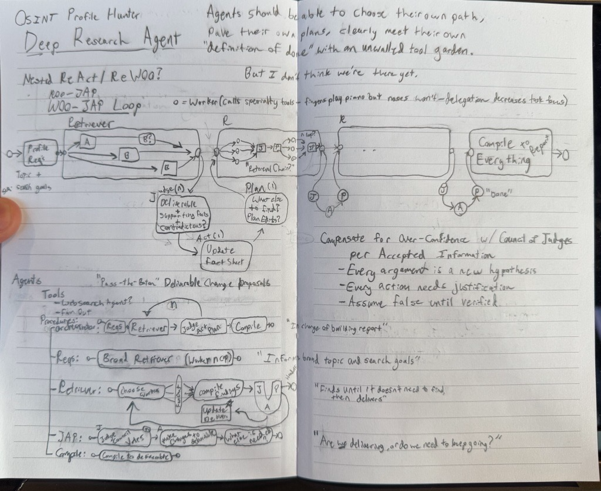

# OSINT Deep Research

This project attempts to show how forcing a model to overthink and validate hierarchically for every decision may allow it to have trustworthy creative freedom. Broader prompting with checks-and-balances at each step of the way may apply enough constraint to be precise, while allowing enough creative freedom to find accuracy. 




## Installation

Requires Python 3.11+ and [Poetry](https://python-poetry.org/).

```bash
# Install dependencies
poetry install

# Run the CLI
poetry run osint-research

# Or activate the virtual environment
poetry shell
osint-research
```


## Design

Agents will be called in "Procedures" (Workflows), where they have the opportunity to modify the outgoing deliverable as a team of sorts. I took inspiration from the Arazzo Spec for my decision to create deterministic workflows, since static procedures take the guesswork out of having agents rely on their own taste for how to deliver long-strung multi-tool workflows (wherever possible). 


## Influence

I wanted to build a Deep Research framework that looks **very deep**, judges itself aggressively using voting, and has increased friction to report a deliverable (where retrieved information must be confirmed or rejected + recollected, instead of immediately treating new context as true or relevant). 

This Deep Research agent just so happens to be tailored for OSINT tasks (OSINT-based tool calls). 


### Why should we be extra selective about each research step?

Since there is a high probability that the agent will be incorrect per-step, maybe there should also be a lower chance for the agent to write anything for the permanent deliverable. 

**It really doesn't take much to poison a context window**. Ideally errors should get rejected as close as possible to the agent that created the mistake (I just spilled water on my laptop while writing this). 

I hope to fix this issue by using a combination of Tool-Calls that 1) fan-out and back in, 2) use N LLM-as-Judge agents (LLM democracy) that also fans-out and back in, and finally 3) have many check-points to prevent bad context from spreading. 


### None of this is scientifically backed

It's a cardinal sin to just guess, but here I am. 

I want to **attempt this project with a fresh perspective before poisoning my own context**. I'll research later, once I've exhausted my own creativity and require better results. Unfortunately, one of the main caveats of my decision to attempt original thoughts first is that they are more likely to be incorrect (hence this entire experiment, ironically) - so this project may not perform well. As of now, I have a running list of assumptions influencing my design based on what I have seen in the wild:

- ReAct / ReWOO Loops (+ Nested) Work, But They Need More Focus - Previous steps shouldn't set future focus, but they should definitely impact future focus somehow. 

- 10 SLMs as a judge perform better than 1 LLM, and may judge faster by running in parallel. This probably isn't true - but I need speed, and also want an excuse to try Nvidia's recent Nemotron Nano SLM. 

- Particularly for ability to do OSINT via Workers/Tool Calls: I assume Web Search and Browser-Use are enough. Browser-Use already performs amazingly for OSINT, but for the purposes of doing one task. 

- (Probably many other assumptions - the list is endless since I'm just going by taste - but I will document why I make my decisions somewhere).

I'm probably going to build evals later too, on a per-agent per-procedure basis, and run benchmarks later too.


### Why so much hierarchy (nested workflows)?

Hierarchy in Corporation Organizational Structures increase effectivity of bad employees. Likewise, I'm hoping hierarchy in Agentic workflows prove the same result, at the cost of more LLM usage. Even if it costs 3000$ a week (today), can it actually surface insights better than a security professional investigating X entity? Guarantees are valuable.

Also, long-running context windows degrade agent performance (today - 12/17/2025), so limiting agents to smaller procedures may improve effectuality of individual deliverables. 

